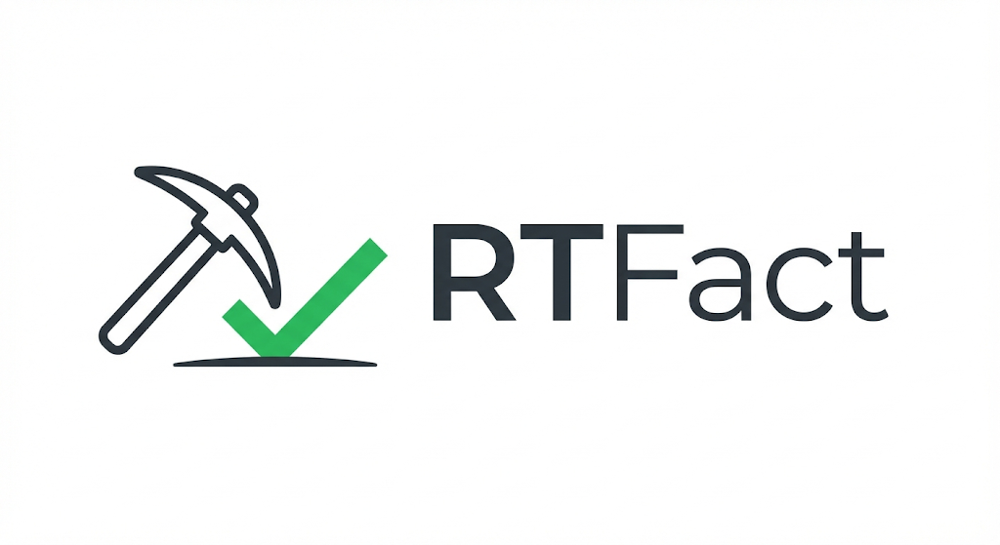
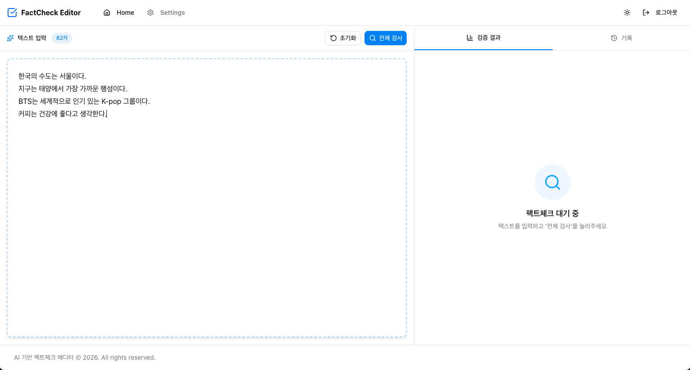
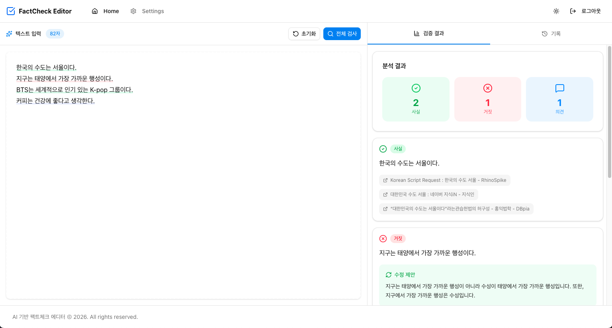
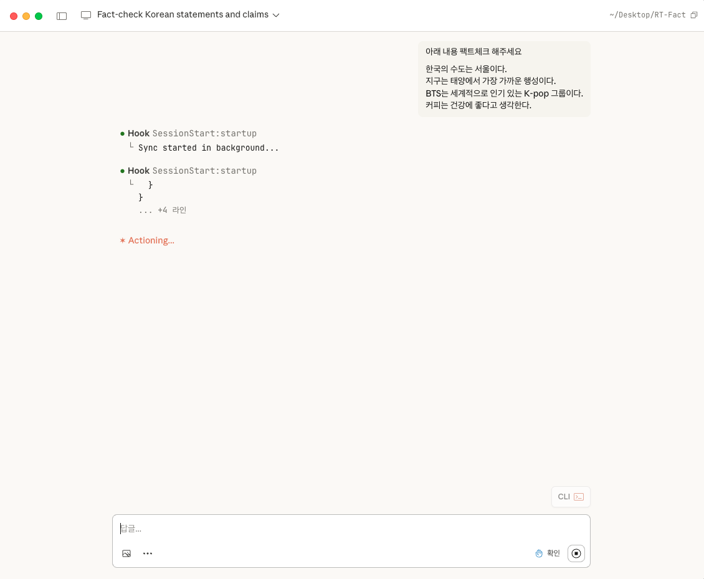
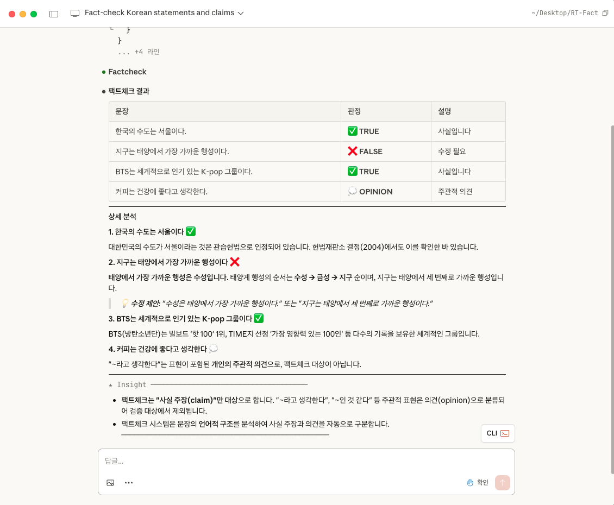

# RT-Fact

<div align="center">

</div>

<div align="center">
<a href="https://github.com/RT-Fact/RT-Fact-FE">Frontend</a> | <a href="https://github.com/RT-Fact/RT-Fact-BE">Backend</a> | <a href="https://github.com/RT-Fact/RT-Fact-MCP">MCP Server</a>
</div>
<br>

<div align="center">

**RT-Fact**는 Root The Fact의 약자로,<br>
글 작성 시 **AI가 실시간으로 사실 여부를 검증**하고 **수정 제안**을 제공하는 웹 에디터입니다.

</div>

## 목차

- [기술 스택](#-기술-스택)
  - [textarea + overlay 직접 구현](#textarea--overlay-직접-구현)
  - [LangGraph](#langgraph)
  - [MCP 아키텍처 분리](#mcp-아키텍처-분리)
- [주요 기능](#-주요-기능)
  - [전체 팩트체크](#전체-팩트체크)
  - [수정 적용](#수정-적용)
  - [MCP 서버](#mcp-서버)
- [기술적 챌린지](#-기술적-챌린지)
  - [텍스트 수정 후 하이라이트 위치가 어긋나는 문제](#1-텍스트-수정-후-하이라이트-위치가-어긋나는-문제)
  - [AI가 문장 위치를 정확히 계산하지 못하는 문제](#2-ai가-문장-위치를-정확히-계산하지-못하는-문제)
- [팀원 소개](#-팀원-소개)

---

## 🛠 기술 스택

### Frontend

      

### Backend

   

### MCP Server

   

### 기술 선택 이유

#### textarea + overlay 직접 구현

**배경**

에디터 요구사항은 텍스트 입력 + 팩트체크 결과 하이라이팅뿐이었습니다. 서식, 이미지, 테이블 등 리치 텍스트 기능은 불필요했습니다.

**검토한 대안**

| 옵션 | 판단 |
|------|------|
| TipTap (ProseMirror 래퍼) | 기능 과다, 번들 크기 부담 |
| ProseMirror 직접 사용 | 학습 곡선 높음, 저수준 API |
| 직접 구현 | 필요 기능만 구현 가능 |

**선택 이유**

1. **불필요한 기능 배제**: 리치 텍스트 에디터는 사용하지 않는 기능이 대부분입니다.
2. **커스터마이징**: 문장별 하이라이팅, 클릭 시 스크롤, 위치 재계산 등 팩트체크 특화 로직을 자유롭게 구현할 수 있습니다.
3. **경량화**: 외부 라이브러리 없이 textarea + overlay로 구현했습니다.

**구현 결과**

textarea 위에 투명 overlay를 겹쳐 하이라이팅을 렌더링합니다. 폰트, 패딩, 줄높이를 동기화하여 텍스트 위치가 정확히 일치하도록 했습니다.

**트레이드오프**

리치 텍스트 기능이 필요해지면 에디터를 교체해야 합니다. 현재 요구사항에서는 plain text로 충분하지만, 마크다운이나 서식 지원이 추가되면 TipTap 등으로 전환이 필요합니다.

#### LangGraph

**배경**

MCP 서버의 팩트체크 파이프라인은 문장별 병렬 검증, 개별 재시도, 에러 격리가 필요했습니다. Tavily 검색 API는 외부 의존성이라 간헐적 실패 가능성이 있어 안정적인 오케스트레이션이 중요했습니다.

**검토한 대안**

| 옵션 | 장점 | 단점 |
|------|------|------|
| LangChain | 빠른 프로토타이핑, 높은 추상화 | 순차 Chain 구조로 병렬 처리/조건부 분기 제한적 |
| 직접 구현 (asyncio) | 완전한 제어, 오버헤드 없음 | 재시도/에러 처리 직접 구현 시 복잡도 급증 |
| LangGraph | 조건부 분기/병렬 처리/재시도 프레임워크 지원 | 학습 곡선, 초기 설정 필요 |

**선택 이유**

1. **병렬 처리 + 개별 재시도**: LangGraph의 `Send API`로 각 문장을 독립된 병렬 노드로 분기하여 검증하고, 실패 시 해당 문장만 재시도할 수 있습니다.
2. **에러 격리**: 10개 문장 중 1개 실패해도 나머지 9개는 정상 처리됩니다.
3. **상태 관리**: 각 노드의 결과를 Reducer 함수로 하나의 상태에 병합하여 누락 없이 수집합니다.

**트레이드오프**

LangChain 대비 학습 곡선이 있고, asyncio 대비 초기 설정 코드량이 늘어납니다. 하지만 복잡한 오케스트레이션 로직을 프레임워크가 지원하여 유지보수가 용이합니다.

#### MCP 아키텍처 분리

**배경**

팩트체크 파이프라인에 LangGraph를 사용하기로 결정했습니다. LangGraph는 Python 전용 라이브러리인데, 백엔드는 NestJS(TypeScript)로 구축 중이었습니다. 또한 향후 이미지(OCR)나 오디오(STT) 입력도 지원하려면, 전처리 서비스를 붙여 텍스트로 변환한 뒤 코어 MCP에서 처리하는 구조가 필요했습니다.

**검토한 대안**

| 옵션 | 판단 |
|------|------|
| 모놀리식 (NestJS에 통합) | LangGraph 사용 불가, 확장 시 코어 수정 필요 |
| 분리형 (별도 MCP 서버) | Python 생태계 활용 가능, 전처리 서비스 플러그인 구조 |

**선택 이유**

1. **기술 스택**: LangGraph, FastMCP 등 AI 에이전트 및 MCP 서버 구축 도구가 Python에 집중되어 있어 Python 기반 서버가 자연스러웠습니다.
2. **확장 가능한 설계**: 텍스트 검증을 코어로 두고, 이미지/오디오 전처리 서비스를 붙이면 코어 수정 없이 입력 타입을 확장할 수 있습니다.
3. **독립적 사용**: 웹 에디터뿐 아니라 Claude Desktop, Cursor 등 MCP 클라이언트에서도 직접 호출할 수 있습니다.

**트레이드오프**

서버가 2개로 분리되어 배포 복잡도가 증가합니다. 하지만 마이크로서비스 구조 덕분에 팀원들이 독립적으로 개발할 수 있어 3주 프로젝트 기간에 오히려 협업에 유리했습니다.

---

## ✨ 주요 기능

<!--
이미지 저장 위치: ./assets/
형식 권장: PNG (정적), GIF (인터랙션)
-->

### 전체 팩트체크

텍스트를 입력하고 전체 검사를 실행하면 각 문장의 사실 여부를 검증합니다. 문장마다 직접 검색하지 않아도 한 번에 확인할 수 있습니다.

| Before | After |
|:------:|:-----:|
|  |  |

### 수정 적용

팩트체크에서 오류로 판정된 문장에 대해 AI가 수정안을 제안합니다. 클릭하면 원문이 자동으로 교체됩니다.

| Before | After |
|:------:|:-----:|
|  |  |

### MCP 서버

Claude, Cursor 등 AI 도구에서 MCP 서버로 팩트체크 기능을 직접 호출할 수 있습니다.

| 요청 | 결과 |
|:----:|:----:|
|  |  |

---

## 🔥 기술적 챌린지

### 1. 텍스트 수정 후 하이라이트 위치가 어긋나는 문제

#### 문제

팩트체크 결과 카드를 클릭하면 해당 문장이 하이라이트되어야 하는데, **텍스트 수정 후 잘못된 위치**가 하이라이트되는 버그가 발생했습니다.

특히 동일한 문장이 2개 이상 있을 때, 두 번째 문장의 카드를 클릭해도 첫 번째 문장이 하이라이트되는 문제가 있었습니다.

```
원문: "지구는 둥글다. 하늘은 파랗다. 지구는 둥글다."
       ↑ 문장1                      ↑ 문장2

1. 전체 검사 → 문장1, 문장2 각각 카드 생성
2. 문장1의 "수정 적용" 클릭 → "지구는 둥글다!!!"로 변경
3. 문장2의 카드 클릭 → 문장2가 아닌 변경된 문장1이 하이라이트됨
```

#### 원인 분석

기존 구현은 매 렌더링마다 `indexOf`로 텍스트를 검색해서 위치를 찾았습니다.

| 원인 | 설명 |
|------|------|
| 텍스트 기반 검색 | 문장 ID가 아닌 텍스트 내용으로 위치를 찾음 |
| 매 렌더링마다 재계산 | 텍스트가 변경되면 다시 검색 |
| 순서 의존성 | 첫 번째로 매칭되는 텍스트를 반환 |

핵심 원인은 **인덱스가 문장 ID와 연결되어 있지 않고 텍스트 내용에만 의존**하는 구조적 문제였습니다.

#### 해결 과정

여러 방법을 조사했습니다.

| 방법 | 장점 | 단점 |
|------|------|------|
| ProseMirror/CodeMirror — 리치 텍스트/코드 에디터 프레임워크 | 라이브러리가 위치 매핑 처리 | plain textarea 사용 중 |
| CRDT (Yjs) — 동시 편집을 위한 분산 자료구조 | 각 문자에 고유 ID, 가장 견고함 | 구현 복잡도 높음 |
| 고유 마커 삽입 | ID 기반 추적 가능 | 복사/붙여넣기 시 마커 유출 |
| **오프셋 조정** | 정확함, 성능 좋음 | delta 계산 로직 필요 |

**오프셋 조정 방식**을 선택했습니다. 최초 검사 시점에 인덱스를 저장하고, 이후 텍스트 변경 시 delta만 조정하는 방식입니다.

Delta 계산 방법도 비교했습니다.

| 방법 | 정확도 | 성능 |
|------|--------|------|
| fast-diff 라이브러리 | 높음 | O(ND) - 무거움 |
| beforeinput 이벤트 | 높음 | O(1) - 가벼움, 구현 복잡 |
| **단순 비교 (양끝 탐색)** | 충분함 | O(n) - 적당 |

외부 의존성 없이 충분한 정확도를 제공하는 **단순 비교 방식**을 선택했습니다.

텍스트가 변경되면 변경 지점과 길이 차이(delta)를 계산합니다. 변경 지점 이전의 문장은 그대로 유지하고, 이후의 문장은 delta만큼 인덱스를 조정하며, 변경 범위와 겹치는 문장은 인덱스를 무효화합니다.

#### 결과

| 항목 | 개선 전 | 개선 후 |
|------|---------|---------|
| 동일 문장 처리 | 첫 매칭만 찾음 | ID 기반으로 각각 추적 |
| 텍스트 변경 시 | 재검색 (위치 틀어짐) | 오프셋만 조정 |
| 성능 | 매 렌더링 O(n×m) | 변경 시만 O(n), 10,000자 기준 0.1ms 이하 |

CRDT는 가장 견고하지만 plain textarea 위에 적용하기엔 과도했습니다. 문제의 범위가 단일 사용자 편집이었기 때문에 오프셋 조정만으로 충분했습니다.

---

### 2. AI가 문장 위치를 정확히 계산하지 못하는 문제

#### 문제

팩트체크 결과를 에디터에 하이라이팅하려면 각 문장의 시작/끝 인덱스가 필요합니다. 처음에는 AI(Gemini)에게 문장 추출과 함께 인덱스도 추출하도록 요청했습니다.

**결과: 인덱스 정확도 0%**

AI가 반환한 인덱스는 단 한 번도 정확하지 않았습니다.

#### 원인 분석

| 원인 | 설명 |
|------|------|
| 토큰 vs 문자 | LLM은 토큰 단위로 처리하지만, 하이라이팅은 문자 단위 인덱스 필요 |
| 비결정적 출력 | 같은 입력에도 다른 인덱스를 반환 |
| AI의 한계 | 텍스트 분류는 잘하지만, 정확한 숫자 계산은 약함 |

#### 해결: 역할 분리

AI에게 모든 걸 맡기는 대신, **각자 잘하는 것에 집중**시켰습니다.

| 역할 | 담당 | 이유 |
|------|------|------|
| 문장 추출 + 분류 | AI | 의미 파악에 강함 |
| 인덱스 계산 | 알고리즘 | 정확한 계산에 강함 |

AI는 문장 텍스트만 반환하고, 인덱스는 원본 텍스트에서 직접 계산했습니다.

#### 결과

| 항목 | 개선 전 | 개선 후 |
|------|---------|---------|
| 인덱스 정확도 | 0% | 100% |

#### 교훈

AI의 한계를 인식하고, AI가 잘하는 것(의미 분류)과 알고리즘이 잘하는 것(정확한 계산)을 분리하는 것이 핵심이었습니다.

---

## 👥 팀원 소개

| 프로필 | 이름 | GitHub |
|:------:|------|--------|
| 😘 | 김정훈 | [@mangmuse](https://github.com/mangmuse) |
| 🥰 | 김태훈 | [@taehoonkim1007](https://github.com/taehoonkim1007) |
| 😇 | 한상진 | [@SangJin983](https://github.com/SangJin983) |
